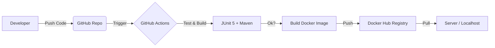

# Todo List API - DevOps CI/CD Pipeline

<!---->


Simple API REST with **Spring Boot** and **Docker**

**CI/CD** pipeline by **GitHub Actions**

## DevOps Cycle


## Run project 
### With Docker
```bash
docker pull padraoo/todo-spring-app:latest
```
```bash
docker run -p 8080:8080 padraoo/todo-spring-app:latest
```

### Locally for dev
```bash
git clone [https://github.com/PedroCarreteiro/SPRING-CICD.git](https://github.com/PedroCarreteiro/SPRING-CICD.git)
cd SPRING-CD
./mvnw spring-boot:run
```

## Endpoints
- GET: /tasks
- POST: /tasks
- DELETE: /tasks/{id}

## General payload
```json
{
  "description": "Description",
  "completed": false
}
```
